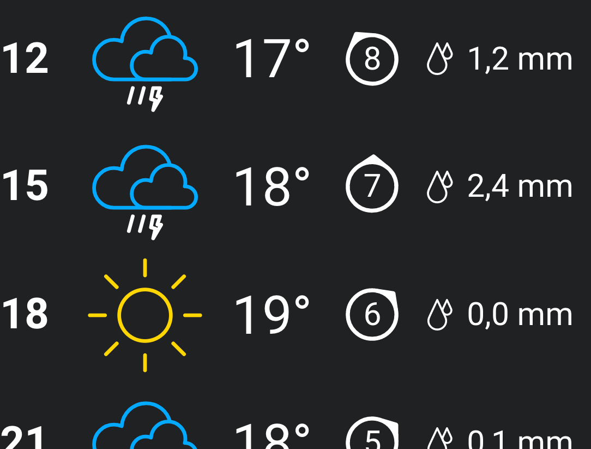

# Weather widget

Widget for showing weather forecasts by [Finnish meteorological institute](https://en.ilmatieteenlaitos.fi/). Uses [MetOLib](https://github.com/fmidev/metolib) for requesting and parsing the weather data. Icons and [weather symbols](https://github.com/katrimarika/weather-icons) created by me.

Built with Node 10, React and Typescript.

## Compact forecast

Compact forecast displays the next five forecasts: time, sybmol, temperature in °C, wind direction and speed in m/s, and amount of rain in mm/h. It is designed for use in a container of an approximate ratio of 2:1 (if used without the title). Text and image sizes scale based on the container width.

Supported query strings:

- `nobg: boolean`, if true use transparent background
- `site: string`, place to get forecast for, e.g. "Kamppi,Helsinki", default: "Helsinki"
- `latlon: string`, latitude and longitude of a place separated with a comma, e.g. "60.170950,24.940755", overrides site if both given
- `interval: number`, number of hours between each displayed forcast, default: 3
- `title: boolean`, if true show the returned place text, use e.g. to check that the place is correct

## Forecast list

Forecast list displays a scrollable list of horizontal forecasts. Similar to the compact forecast, with the additional query strings:

- `list: boolean`, if true use forecast list instead of compact
- `count: number`, number of forecast items to fetch, default: 5, max: 24

## Observation

Observation returns the nearest (land) observation values for given place.

Supported query strings:

- `observation: boolean`, if true use observation instead of forecast
- `nobg: boolean`, if true use transparent background
- `site: string`, place to get forecast for, e.g. "Kamppi,Helsinki", default: "Helsinki"
- `latlon: string`, latitude and longitude of a place separated with a comma, e.g. "60.170950,24.940755", overrides site if both given
- `title: boolean`, if true show the returned observation station place and recorded time of observation
- `lang: string`, "fi" or "en" for language of observation value names, default: fi

---

This project was bootstrapped with [Create React App](https://github.com/facebook/create-react-app).

## Available Scripts

In the project directory, you can run:

### `yarn start`

Runs the app in the development mode. 
Open [http://localhost:3000](http://localhost:3000) to view it in the browser.

The page will reload if you make edits. 
You will also see any lint errors in the console.

### `yarn test`

Launches the test runner in the interactive watch mode. 
See the section about [running tests](https://facebook.github.io/create-react-app/docs/running-tests) for more information.

### `yarn build`

Builds the app for production to the `build` folder. 
It correctly bundles React in production mode and optimizes the build for the best performance.

The build is minified and the filenames include the hashes. 
Your app is ready to be deployed!

See the section about [deployment](https://facebook.github.io/create-react-app/docs/deployment) for more information.

### `yarn eject`

**Note: this is a one-way operation. Once you `eject`, you can’t go back!**

If you aren’t satisfied with the build tool and configuration choices, you can `eject` at any time. This command will remove the single build dependency from your project.

Instead, it will copy all the configuration files and the transitive dependencies (Webpack, Babel, ESLint, etc) right into your project so you have full control over them. All of the commands except `eject` will still work, but they will point to the copied scripts so you can tweak them. At this point you’re on your own.

You don’t have to ever use `eject`. The curated feature set is suitable for small and middle deployments, and you shouldn’t feel obligated to use this feature. However we understand that this tool wouldn’t be useful if you couldn’t customize it when you are ready for it.

## Learn More

You can learn more in the [Create React App documentation](https://facebook.github.io/create-react-app/docs/getting-started).

To learn React, check out the [React documentation](https://reactjs.org/).
